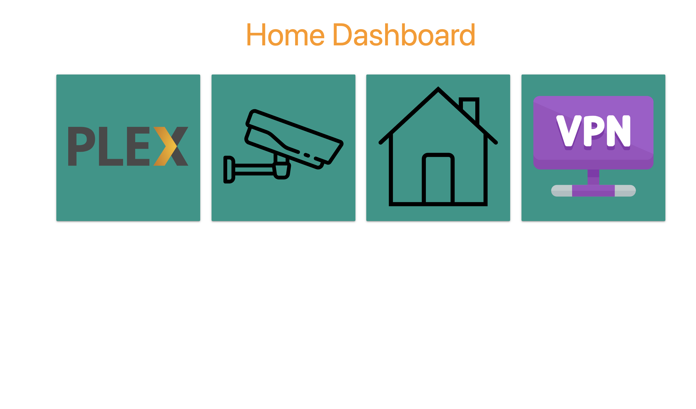

# Home Dashboard

Why another web dashboard?  This is designed to a simple, minimal home dashboard that allows specifying links to other services & is easily configurable from a file mounted to the docker container.  The example deployment in the ```deployment``` directory includes how this can be done with a config map in Kubernetes.

